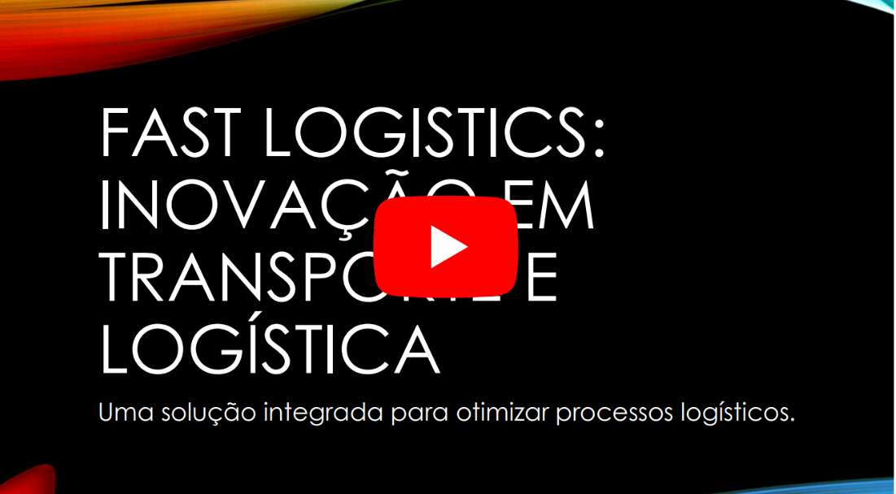

# Fast Logistics

Fast Logistics é um projeto que tem como objetivo automatizar a operação de empresas de logística e transporte para melhorar a eficiência operacional e reduzir custos. O sistema integrado permite que as empresas acompanhem em tempo real todas as etapas do processamento de uma encomenda, desde o monitoramento dos veiculos  até a entrega final. Cada etapa do processo é registrada no sistema, garantindo que os gestores tenham uma visão clara e atualizada do status de cada encomenda, permitindo a identificação e resolução rápida de quaisquer problemas que possam surgir. 
Além disso, o sistema proporciona uma interface dedicada aos clientes, onde poderão visualizar o status das suas encomendas em tempo real, aumentando a transparência e a confiança no serviço prestado.

## Alunos integrantes da equipe

* [Enzo Rodrigues Soares](https://github.com/enzorodrigues)
* [Helder Thadeu de Souza Santos](https://github.com/helderthadeu)
* [Gabriel Vieira Franco Vilaça](https://github.com/gabvilaaa)

## Professor responsável

* [Felipe Augusto Lima Reis](https://github.com/falreis)

## Gerenciamento do Projeto

Fases do Gerenciamento do Projeto:
1. [Iniciação](docs/01-iniciacao)
2. [Planejamento](docs/02-planejamento)
3. [Execução](docs/03-execucao)
4. [Monitoramento](docs/04-monitoramento)
5. [Encerramento](docs/05-encerramento)

## Apresentação do Trabalho

