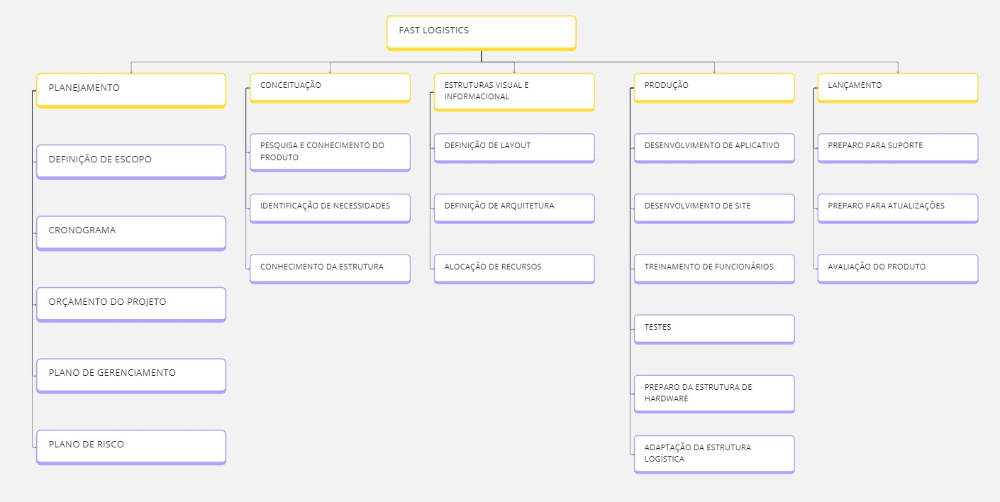
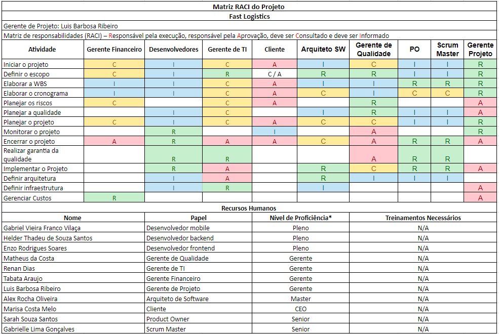

# Planejamento

> A fase de planejamento na gerência de projetos é um momento onde os detalhes do projeto são minuciosamente definidos para garantir uma execução bem-sucedida. 
> Durante essa etapa, os gerentes de projeto e suas equipes elaboram um plano abrangente que aborda aspectos como cronograma, orçamento, recursos necessários, riscos identificados e métodos de controle. 
> O objetivo é criar uma estrutura que guiará as atividades ao longo do projeto, garantindo que metas sejam alcançadas de maneira eficiente. 
> O plano de projeto não apenas define as tarefas específicas e suas interdependências, mas também estabelece critérios de sucesso e indicadores de desempenho. 
> A qualidade do planejamento influencia diretamente a capacidade da equipe em cumprir prazos, alocar recursos eficientemente e lidar com desafios que possam surgir durante a execução.

# Estrutura do Documento

- [Fase de Planejamento](#planejamento)
- [Escopo do Projeto](#escopo-do-projeto)
- [Estrutura Analítica do Projeto](#estrutura-analítica-do-projeto)
- [Matriz de Responsabilidades](#matriz-de-responsabilidades)
- [Cronograma do Projeto](#cronograma-do-projeto)
- [Orçamento do Projeto](#orçamento-do-projeto)
- [Planos de Gerenciamento](#planos-de-gerenciamento)
  - [Plano de Qualidade](#plano-de-qualidade)
  - [Plano de Aquisição](#plano-de-aquisição)
  - [Plano de Comunicação](#plano-de-comunicação)
  - [Plano de Riscos](#plano-de-riscos)

-----

# Escopo do Projeto

O projeto consiste no desenvolvimento de um sistema integrado que abrange um software WEB e um aplicativo mobile, com o objetivo de aprimorar o gerenciamento dos processos logísticos da Transportadora Tupí. O aplicativo mobile será projetado para permitir que os entregadores recebam e definam rotas de entrega, confirmem a entrega dos produtos com uma foto, reportem qualquer erro que ocorra durante o processo e monitorem sua localização em tempo real. <br>

O software WEB, acessível pela empresa cliente, oferecerá uma série de funcionalidades essenciais. Ele permitirá o registro e gerenciamento das encomendas, a definição e otimização das rotas de entrega, e o acompanhamento do status de processamento das encomendas. Além disso, o sistema possibilitará a emissão de notas fiscais e fornecerá informações detalhadas sobre os entregadores, como dados pessoais e placa do veículo, bem como a localização atual dos mesmos. <br>

Para o setor financeiro da empresa, o software WEB incluirá uma funcionalidade de acompanhamento financeiro das entregas. Também permitirá a visualização da capacidade do centro de distribuição, com informações sobre o inventário disponível. O sistema proporcionará a emissão de relatórios detalhados sobre as entregas e o desempenho logístico e possibilitará o registro e gestão de entregadores autônomos.
Os clientes finais poderão rastrear suas entregas em tempo real por meio do aplicativo mobile. Adicionalmente, o software WEB incluirá funções administrativas para a adição e remoção de usuários, garantindo a gestão eficiente do sistema. <br>

O projeto será desenvolvido seguindo um cronograma que inclui fases de planejamento, desenvolvimento, testes, implementação e suporte. Durante a fase de planejamento, serão definidos os requisitos e o plano do projeto. A fase de desenvolvimento envolverá a codificação e implementação das funcionalidades. Na fase de testes, serão realizados testes de funcionalidade, usabilidade e segurança. Após a implementação, será oferecido treinamento para os usuários finais e administradores, seguido de suporte técnico e manutenção contínua.<br>

Este sistema integrado visa melhorar significativamente a eficiência das operações logísticas da Transportadora Tupí, proporcionando uma gestão mais eficaz e uma melhor experiência para clientes e entregadores.


# Estrutura Analítica do Projeto




### Documento Editável

- [Estrutura Analítica do Projeto - Editável](artefatos/estrutura_analitica_projeto.wbs)

-----

# Matriz de Responsabilidades

> A Matriz de Responsabilidades é uma ferramenta para definir e indicar as responsabilidades de cada membro da equipe em relação às atividades do projeto. 
> Também conhecida como RACI (Responsável, Aprovador, Consultado e Informado), essa matriz atribui papéis específicos a cada envolvido, indicando quem é responsável pela execução de uma tarefa, quem deve aprovar, quem precisa ser consultado e quem deve ser mantido informado. 
> Ao criar uma visão visual e estruturada das responsabilidades, a matriz RACI minimiza ambiguidades e conflitos de papel.
> Essa ferramenta não apenas esclarece as expectativas em termos de contribuições individuais, mas também contribui para um ambiente de trabalho mais organizado e transparente, resultando em uma gestão de projeto mais eficaz e bem-sucedida.

> Informações Adicionais:
> * **R**esponsible -> Executor (pessoa(s) que executará(ão)/desenvolverá(ão) a atividade).
> * **A**ccountable -> Responsável (pessoa responsável por aprovar a atividade).
> * **C**onsulted   -> Consultado (especialista consultado sobre a atividade ou parte dela).
> * **I**nformed    -> Informado (pessoas interessadas no projeto que devem ser informadas sobre a execução).




### Documento Editável
- [Matriz de Responsabilidades (RACI) - Editável](artefatos/MatrizRaci.xlsx)

-----
```diff
+ Tarefa 07:
+ Cronograma do Projeto
```

# Cronograma do Projeto

......  DESCREVA EM LINHAS GERAIS O CRONOGRAMA DO SEU PROJETO AQUI ......

> O cronograma do projeto fornece uma representação temporal detalhada de todas as atividades, marcos e eventos ao longo do ciclo de vida do projeto. 
> Elaborado durante o planejamento, o cronograma é uma ferramenta que oferece uma visão das interdependências entre as tarefas, alocando recursos e definindo prazos para as entregas.
> Utilizando técnicas como a análise de rede (PERT/CPM) e estimativas de duração, o cronograma ajuda na identificação de caminhos críticos, permitindo aos gestores de projeto otimizar recursos, antecipar potenciais atrasos e tomar decisões. 
> Além disso, o cronograma serve como um guia para monitorar o progresso, comunicar efetivamente com a equipe e as partes interessadas, e ajustar estratégias para garantir a conclusão bem-sucedida do projeto dentro dos prazos estabelecidos.

### Documento Editável

> Você deve atualiza o seguinte link (ou link correspondente), como o arquivo editável do Cronograma do Projeto:
- [Cronograma e Orçamento do Projeto - Editável](artefatos/cronograma_orcamento.pod)

```diff
+ Tarefa 07:
+ Fim da seção a ser atualizada.
```

-----
```diff
+ Tarefa 08:
+ Orçamento do Projeto
```

# Orçamento do Projeto


......  DESCREVA EM LINHAS GERAIS O ORÇAMENTO DO SEU PROJETO AQUI ......

> O orçamento do projeto envolve a estimativa e alocação de recursos financeiros necessários para a execução bem-sucedida do projeto, abrangendo custos diretos e indiretos, despesas operacionais, investimentos em equipamentos, pessoal, entre outros. 
> O desenvolvimento do orçamento deve considerar variáveis como riscos, imprevistos e mudanças no escopo. 
> Uma vez estabelecido, o orçamento serve como guia para a utilização eficiente dos recursos financeiros ao longo do projeto. 
> A gestão do orçamento não apenas ajuda a controlar os custos, mas também fornece transparência e prestação de contas, permitindo que gestores tomem decisões informadas e evitem surpresas financeiras ao longo do ciclo de vida do projeto. 
> Assim, o orçamento contribui para o sucesso do projeto, garantindo a viabilidade econômica e a entrega dentro das expectativas financeiras estabelecidas.

### Documento Editável

> Você deve atualiza o seguinte link (ou link correspondente), como o arquivo editável do Orçamento do Projeto:
- [Cronograma e Orçamento do Projeto - Editável](artefatos/cronograma_orcamento.pod)

```diff
+ Tarefa 08:
+ Fim da seção a ser atualizada.
```

# Planos de Gerenciamento

> Os planos de gerenciamento do projetos consolidam as diretrizes e estratégias para a execução bem-sucedida de um empreendimento. 
> Ele abrange diversos aspectos, como escopo, cronograma, custos, riscos, qualidade, recursos humanos, comunicação e aquisições, proporcionando uma visão abrangente e integrada do projeto. 
> Este plano funciona como um guia mestre que orienta a equipe de projeto e as partes interessadas ao longo do ciclo de vida do projeto, estabelecendo expectativas, responsabilidades e processos. 
> Além disso, serve como um instrumento de comunicação, alinhando as expectativas entre os membros da equipe e as partes interessadas, mitigando riscos e fornecendo uma estrutura sólida para a tomada de decisões. 

```diff
+ Tarefa 09:
+ Checklist de Qualidade
```

## Plano de Qualidade


O plano de Qualidade do projeto Fast Logistic visa cubrir os principais processos realizados durante as operações em tempo de desenvolvimento, além disso planeja deixar uma plataforma pré-implantada para ajudar as futuras manutenções necessárias em seu cotidiano de utilização. 

Os projetos com seus produtos e sub-produtos serão cobertos por meio de análise de KPI's que verificam se há qualidades nas entradas ou saídas de cada tarefa. Por meio deste processo será possível análisar quais pontos necessitam de melhorias, e quais precisam ser ampliados para diferentes áreas.

> O Plano de Qualidade auxilia a garantir que as entregas do projeto atendam aos padrões de qualidade definidos. 
> Este plano abrange atividades como definição de padrões, procedimentos de garantia de qualidade, critérios de aceitação e processos de monitoramento e controle da qualidade ao longo do ciclo de vida do projeto. 
> Ao identificar metas de qualidade, responsabilidades da equipe, e métricas de avaliação, o Plano de Qualidade busca assegurar que o projeto atinja ou exceda as expectativas dos stakeholders em termos de desempenho e conformidade. 
> A adoção de políticas de qualidade auxilia a mitigar riscos, promove a confiança nas entregas do projeto e, por fim, aumenta a probabilidade de sucesso do empreendimento. 

> Referência - Conceitual
> * https://www.researchgate.net/publication/230636169_Software_Quality_Assurance

> Normas de Qualidade:
> * https://repositorium.uminho.pt/bitstream/1822/27266/1/Tese_MEI_PG19676_Juliana%20Oliveira.pdf
> * https://cin.ufpe.br/~processos/TAES3/Livro/00-LIVRO/07-Normas%20ISO%20e%20Qualidade%20de%20Software-v6_CORRIGIDO.pdf

> Métricas de software:
> * https://repositorio.unicamp.br/Busca/Download?codigoArquivo=489087
> * https://lume.ufrgs.br/bitstream/handle/10183/66095/000870909.pdf?sequence=1
> * https://www.computerweekly.com/br/tip/23-metricas-de-desenvolvimento-de-software-que-devem-ser-monitoradas

> Processos de Garantia da Qualidade de Software
> * https://ceur-ws.org/Vol-3200/paper22.pdf
> * https://citeseerx.ist.psu.edu/document?repid=rep1&type=pdf&doi=d6bd60206282a2d4449e414e81a703612ef78a0c
> * https://www.testbytes.net/blog/quality-assurance-process-methodology/
> * https://www.projectmanager.com/blog/quality-assurance-and-testing

> Você pode utilizar como referência o seguinte documento:
> [Checklist de Qualidade](artefatos/checklist_qualidade.docx)

### Artefatos a serem verificados


### Padrões e Normas Utilizadas


### Ambiente das Atividades de Qualidade

| Ambiente   | Descrição   | 
|------------|-------------|
|            |             |
|            |             |
|            |             |
|            |             |

### Equipe de Qualidade

| Nome       | Responsabilidade | 
|------------|------------------|
|            |                  |
|            |                  |
|            |                  |
|            |                  |
|            |                  |

### Metodologias de Qualidade Utilizadas

| Nome       | Descrição   | 
|------------|-------------|
|            |             |
|            |             |
|            |             |

```diff
+ Tarefa 09:
+ Fim da seção a ser atualizada.
```

```diff
+ Tarefa 10:
+ Especificação de Produto para Aquisição
```

## Plano de Aquisição

> O Plano de Aquisições define o processo relacionado à aquisição de bens e serviços necessários para a execução do projeto. 
> Este plano abrange a identificação de necessidades, a seleção de fornecedores, a elaboração de contratos, e a gestão do relacionamento com os fornecedores durante do ciclo de vida do projeto. 
> O Plano de Aquisições visa garantir a aquisição eficiente e eficaz dos recursos necessários, minimizando riscos e custos. 
> Além disso, ele proporciona transparência nas relações com fornecedores, promovendo a conformidade com os prazos estabelecidos e padrões de qualidade. 

### Documento Editável

> Você deve atualiza o seguinte link (ou link correspondente), como o arquivo editável de geração da WBS:
- [Especificação Produto Aquisição](https://github.com/user-attachments/files/17760541/aquisicao_produtos.pdf)


```diff
+ Tarefa 10:
+ Fim da seção a ser atualizada.
```

```diff
+ Tarefa 11:
+ Plano de Comunicação
```

## Plano de Comunicação

...... DESCREVA SUCINTAMENTE O PLANO DE COMUNICAÇÃO UTILIZADO NO PROJETO ......

> O Plano de Comunicação estabelece estratégias e diretrizes para facilitar a troca de informações entre os membros da equipe e as partes interessadas. 
> Este plano abrange aspectos como os meios de comunicação, a frequência das atualizações, os canais de distribuição de informações e os responsáveis pela comunicação. 
> Uma comunicação eficiente não apenas previne mal-entendidos e conflitos, mas também fortalece o engajamento da equipe e o apoio das partes interessadas. 
>
> Você pode utilizar como referência o seguinte documento:
- [Plano de Gerenciamento de Comunicação - Editável](artefatos/plano_comunicacao.docx)

### Plano de Comunicação do Projeto

| Entregável                         | Público Alvo | Met. Comunicação | Frequência  | Responsável | 
|------------------------------------|--------------|------------------|-------------|-------------|
| Ata de reunião                     |              |                  |             |             |
| Declaração de escopo               |              |                  |             |             |
| WBS                                |              |                  |             |             |
| Dicionário da WBS                  |              |                  |             |             |
| Cronograma                         |              |                  |             |             |
| Lista de Riscos                    |              |                  |             |             |
| Plano de qualidade                 |              |                  |             |             |
| Plano de projeto                   |              |                  |             |             |
| Relatório de Progresso             |              |                  |             |             |
| Relatório de Aderência ao Processo |              |                  |             |             |
| Checklists de Inspeção             |              |                  |             |             |
|                                    |              |                  |             |             |
|                                    |              |                  |             |             |
|                                    |              |                  |             |             |

> Legenda:
> - Público: a quem se destina a comunicação.
> - Método de Comunicação: e_mail, reunião presencial, reunião virtual, etc.
> - Freqüência: diária, semanal, quinzenal, mensal, etc.
> - Responsável: pessoa responsável pela comunicação.

### Plano de Gerência de Comunicação

> Indique:
> - Ferramentas utilizadas no projeto - adicionar link de acesso às ferramentas
> - Papéis: responsáveis pelas correspondentes no projeto
> - Princípios gerais: indica quais princípios serão adotados no plano de comunicação, como clareza, objetividade, impessoalidade, imparcialidade e cordialidade. Detalhar.
>
> Plano de Gerência de Configuração: definir, em linhas gerais, como (ferramenta) serão controladas e distribuídas as versões e se haverá algum controle de responsabilidades.

- Ferramentas utilizadas:
- - [Ferramenta 01](https://pucminas.br)
  - [Ferramenta 02](https://pucminas.br)
  - [Ferramenta 03](https://pucminas.br)
- Papéis:
- - ...
  - ...
  - ...
- Princípios gerais
- - ...
  - ...
  - ...
  - ...

```diff
+ Tarefa 11:
+ Fim da seção a ser atualizada.
```

```diff
+ Tarefa 12:
+ Riscos do Projeto
```

## Plano de Riscos

......  COLOQUE AQUI O SEU TEXTO ......


> O plano de riscos busca antecipar, avaliar e mitigar os desafios potenciais que podem surgir ao longo do projeto. 
> Este documento estratégico oferece uma visão global dos riscos, categorizando-os e delineando estratégias para lidar com cada uma das possíveis adversidades. 
> Inicialmente, é realizada a identificação detalhada dos riscos, abrangendo desde ameaças imprevistas até oportunidades que podem ser exploradas. 
> Uma vez catalogados, os riscos são avaliados quanto à sua probabilidade de ocorrência e impacto, permitindo a priorização e foco em áreas críticas.
>
> O plano de riscos não apenas destaca os perigos em potencial, mas também estabelece respostas e estratégias de contingência. 
> Isso inclui a definição de ações preventivas para mitigar riscos antes que se materializem, bem como estratégias de mitigação para minimizar seu impacto se ocorrerem. 
> Além disso, a identificação de pontos de monitoramento contínuo ao longo do projeto permite uma resposta ágil às mudanças nas condições do ambiente.
>
> Você pode utilizar como referência o seguinte documento:
- [Plano de Gerenciamento de Riscos - Editável](artefatos/plano_riscos.xls)

| Categoria do Risco  | Descrição do Risco | Impacto       | Risco         | Medidas de Prevenção (Contramedidas) | Medidas de Contingência (Mitigação) | 
|---------------------|--------------------|---------------|---------------|--------------------------------------|-------------------------------------|
|                     |                    |               |               |                                      |                                     |
|                     |                    |               |               |                                      |                                     |
|                     |                    |               |               |                                      |                                     |
|                     |                    |               |               |                                      |                                     |
|                     |                    |               |               |                                      |                                     |
|                     |                    |               |               |                                      |                                     |
|                     |                    |               |               |                                      |                                     |
|                     |                    |               |               |                                      |                                     |
|                     |                    |               |               |                                      |                                     |
|                     |                    |               |               |                                      |                                     |

> Indique:
> Categoria do Risco: *ex.: Cliente, Cronograma, Orçamento, Aquisição de produtos, etc*
> Descrição do Risco: *ex.: Cliente não aparenta ter muito interesse no projeto*
> Impacto: *Baixo / Médio / Alto*
> Risco: *Baixo / Médio / Alto*
> Medidas de Prevenção: *Medidas que devem ser adotadas para evitar que o risco se concretize*
> Medidas de Contingência: *Medidas que devem ser adotadas caso o risco se concretize*
>
> *Obs.: Para determinar o risco considere a seguinte combinação entre Probabilidade e Impacto:

| Probabilidade | Impacto       | Risco         |
|---------------|---------------|---------------|
| Baixo         | Baixo         | Baixo         |
| Médio         | Médio         | Médio         |
| Alto          | Alto          | Alto          |
| Baixo         | Médio         | Médio         |
| Médio         | Baixo         | Médio         |
| Baixo         | Alto          | Médio         |
| Alto          | Baixo         | Médio         |
| Médio         | Alto          | Alto          |
| Alto          | Médio         | Alto          |


```diff
+ Tarefa 12:
+ Fim da seção a ser atualizada.
```

-----


